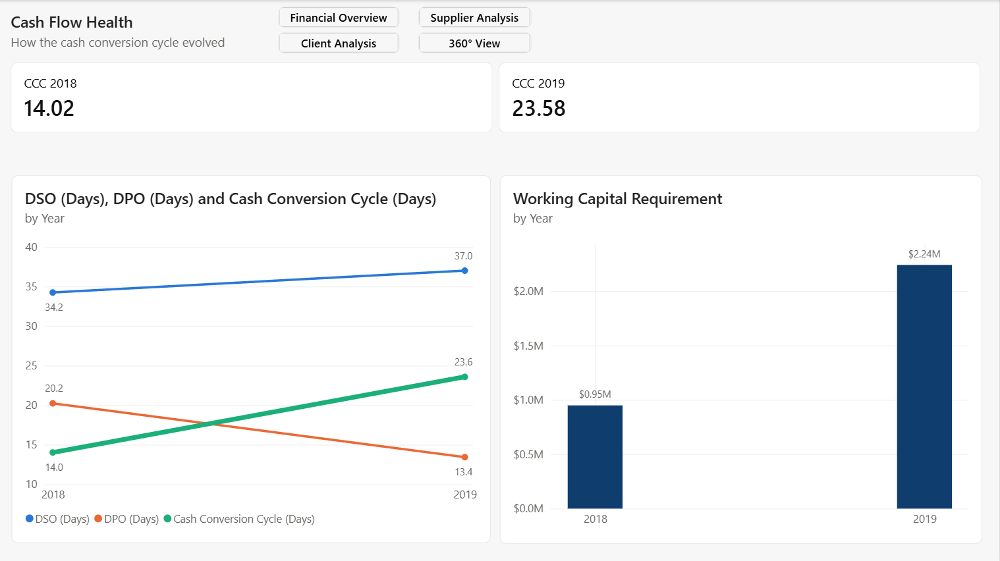

🌐 [Português](README.pt-BR.md) · **English**

# Financial BI Project — Cash Flow Analysis in Power BI

End-to-end Business Intelligence project analyzing a Brazilian Accounts Receivable / Accounts Payable dataset: star-schema modeling, DAX time intelligence, and a four-page executive dashboard built to answer real cash-flow questions.

> **Note on language:** Data values are in Portuguese (Brazilian dataset). All technical artifacts — table names, measures, KPIs, and documentation — are in English, targeting an international audience.

---

## Dataset

- **Domain:** Accounts Receivable (AR) & Accounts Payable (AP)
- **Period:** January 2018 – December 2019 (24 months)
- **Volume:** ~2,700 transactions across 5 tables
- **Model:** Star schema — 3 dimensions (Clients, Suppliers, Banks), 2 fact tables (Receipts, Payments), 1 dedicated Date table

---

## Tech Stack

Power BI Desktop · DAX · Power Query · Star-schema data modeling

---

## Dashboard Pages

### 1. Financial Overview


The executive entry point — answers the first question any finance stakeholder asks: *is the operation generating or consuming cash?*

- KPI cards: Total Received, Total Paid, Net Cash Flow, transaction count
- Monthly trend of cash in vs cash out, and cumulative net position
- Year-over-year comparison and revenue mix

**Key finding:** Revenue grew +40% YoY, but payments grew +72% — cash retention fell from 64% to 56%. The business is cash-positive but **margin is compressing**.

---

### 2. Client Analysis


*Who drives revenue and how reliably they pay.*

- ABC / Pareto curve of revenue concentration
- Top 10 clients, revenue by state, receivables aging
- KPIs: active clients, activation rate, DSO, on-time collection %

**Key finding:** Just **7 clients drive 78% of revenue** (top 4 = 69%, mostly one "CAL" group) — high concentration risk. But **83.6% of receivables are collected on time**, so the risk is strategic (dependency), not operational (they pay reliably).

---

### 3. Supplier Analysis


*Who we depend on and how we pay them.*

- ABC / Pareto curve of spend concentration
- Spend by state, payment timing distribution
- KPIs: active suppliers, DPO, and the Cash Conversion Cycle

**Key finding:** **One supplier (DEPINUS) accounts for 40% of all spend** — bilateral concentration (few clients on revenue, one dominant supplier on cost). Payments are highly disciplined: 80% settled exactly on the due date.

---

### 4. Cash Flow Health (360° View)


The consolidated layer — cross-cutting analysis that only emerges when both sides meet.

- DSO, DPO and CCC trend (2018 → 2019)
- Working capital tied up by the cycle

**Key finding (the strongest one):** The **Cash Conversion Cycle nearly doubled** in one year (14 → 24 days) — the company started collecting slower *and* paying faster simultaneously. This trapped **~$1.3M more working capital** in 2019 vs 2018. The actionable lever is DPO: restoring 2018-level payment timing would meaningfully shorten the cycle.

---

## Repository Structure

```
├── data/          Source dataset (Excel)
├── pbix/          Power BI report file
├── screenshots/   Dashboard page captures
├── docs/          Technical documentation & study manual
└── README.md
```

---

## What This Project Demonstrates

- **Data modeling:** clean star schema, marked date table, correct relationships
- **DAX:** ~32 measures, from base aggregations to running totals, rankings, and financial cycle KPIs
- **Analytical depth:** every page ends with a business finding, not just charts — including data-quality flags (e.g., 95% of registered clients are inactive) and trend detection (deteriorating cash cycle)
- **Communication:** consistent visual language (blue = inflow, orange = outflow), page-level narrative, documented assumptions and caveats
