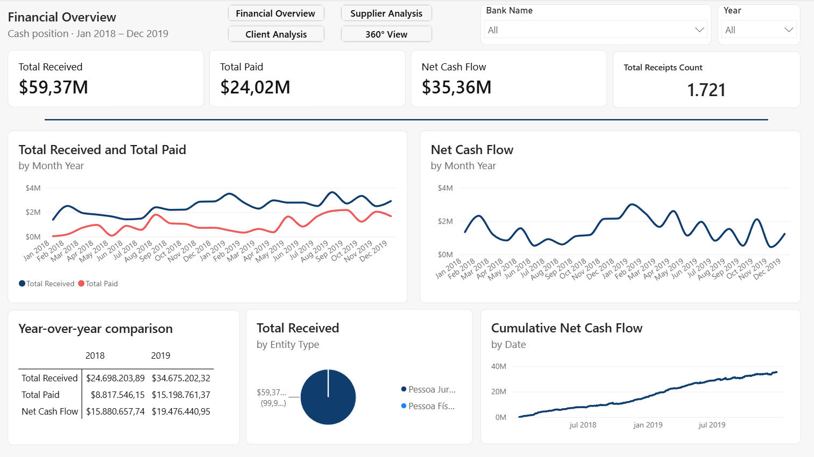
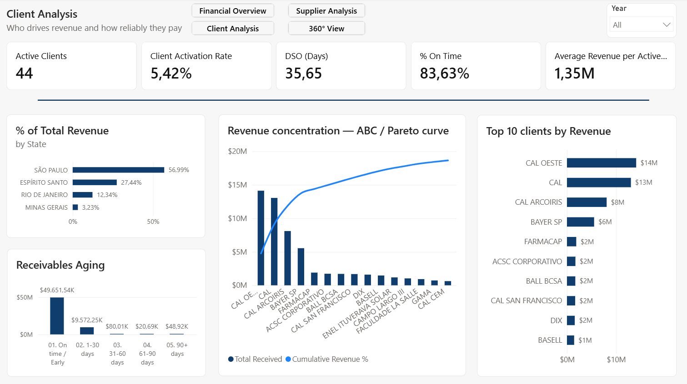
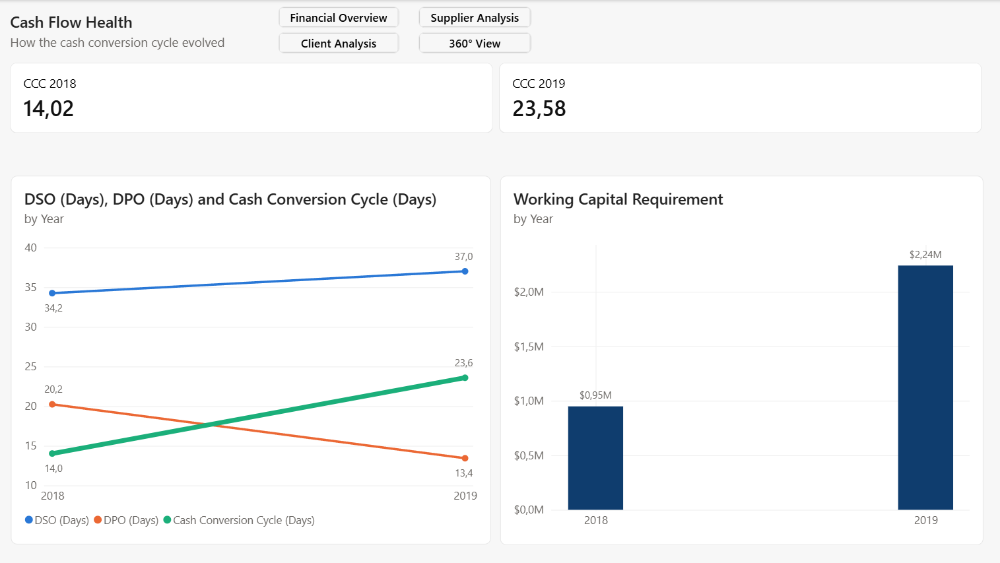

🌐 [English](README.md) · **Português**

# Projeto de BI Financeiro — Análise de Fluxo de Caixa em Power BI

Projeto completo de Business Intelligence analisando uma base brasileira de Contas a Receber / Contas a Pagar: modelagem em star schema, inteligência temporal em DAX e um dashboard executivo de quatro páginas construído para responder perguntas reais de fluxo de caixa.

> **Nota sobre idioma:** Os valores dos dados estão em português (base brasileira). Todos os artefatos técnicos — nomes de tabelas, medidas, KPIs e documentação — estão em inglês, visando um público internacional.

---

## Base de Dados

- **Domínio:** Contas a Receber (AR) e Contas a Pagar (AP)
- **Período:** Janeiro de 2018 – Dezembro de 2019 (24 meses)
- **Volume:** ~2.700 transações em 5 tabelas
- **Modelo:** Star schema — 3 dimensões (Clientes, Fornecedores, Bancos), 2 tabelas fato (Recebimentos, Pagamentos), 1 tabela Calendário dedicada

---

## Tecnologias

Power BI Desktop · DAX · Power Query · Modelagem em star schema

---

## Páginas do Dashboard

### 1. Financial Overview (Visão Geral Financeira)


O ponto de entrada executivo — responde à primeira pergunta que qualquer gestor financeiro faz: *a operação está gerando ou consumindo caixa?*

- Cartões de KPI: Total Recebido, Total Pago, Fluxo de Caixa Líquido, contagem de transações
- Tendência mensal de entradas vs saídas e posição líquida acumulada
- Comparativo ano a ano e composição da receita

**Principal achado:** A receita cresceu +40% ano a ano, mas os pagamentos cresceram +72% — a retenção de caixa caiu de 64% para 56%. O negócio é positivo em caixa, mas a **margem está comprimindo**.

---

### 2. Client Analysis (Análise de Clientes)


*Quem gera a receita e com que pontualidade paga.*

- Curva ABC / Pareto de concentração de receita
- Top 10 clientes, receita por estado, aging de recebíveis
- KPIs: clientes ativos, taxa de ativação, DSO, % de recebimento em dia

**Principal achado:** Apenas **7 clientes concentram 78% da receita** (top 4 = 69%, majoritariamente um grupo "CAL") — alto risco de concentração. Porém **83,6% dos recebíveis são pagos em dia**, então o risco é estratégico (dependência), não operacional (eles pagam com confiabilidade).

---

### 3. Supplier Analysis (Análise de Fornecedores)


*De quem dependemos e como pagamos.*

- Curva ABC / Pareto de concentração de gasto
- Gasto por estado, distribuição de pontualidade de pagamento
- KPIs: fornecedores ativos, DPO e o Ciclo de Conversão de Caixa

**Principal achado:** **Um único fornecedor (DEPINUS) responde por 40% de todo o gasto** — concentração bilateral (poucos clientes na receita, um fornecedor dominante no custo). Os pagamentos são muito disciplinados: 80% liquidados exatamente na data de vencimento.

---

### 4. Cash Flow Health (Saúde do Fluxo de Caixa — Visão 360°)


A camada consolidada — análise cruzada que só emerge quando os dois lados se encontram.

- Tendência de DSO, DPO e CCC (2018 → 2019)
- Capital de giro imobilizado pelo ciclo

**Principal achado (o mais forte):** O **Ciclo de Conversão de Caixa quase dobrou** em um ano (14 → 24 dias) — a empresa passou a receber mais devagar *e* pagar mais rápido ao mesmo tempo. Isso imobilizou **~$1,3M a mais de capital de giro** em 2019 vs 2018. A alavanca acionável é o DPO: restaurar o prazo de pagamento de 2018 encurtaria o ciclo de forma relevante.

---

## Estrutura do Repositório

```
├── data/          Base de dados de origem (Excel)
├── pbix/          Arquivo do relatório Power BI
├── screenshots/   Capturas das páginas do dashboard
├── docs/          Documentação técnica e manual de estudo
└── README.md
```

---

## O Que Este Projeto Demonstra

- **Modelagem de dados:** star schema limpo, tabela calendário marcada, relacionamentos corretos
- **DAX:** ~32 medidas, de agregações base a totais acumulados, rankings e KPIs de ciclo financeiro
- **Profundidade analítica:** cada página termina com um achado de negócio, não só gráficos — incluindo alertas de qualidade de dados (ex: 95% dos clientes cadastrados estão inativos) e detecção de tendência (deterioração do ciclo de caixa)
- **Comunicação:** linguagem visual consistente (azul = entrada, laranja = saída), narrativa por página, premissas e ressalvas documentadas
